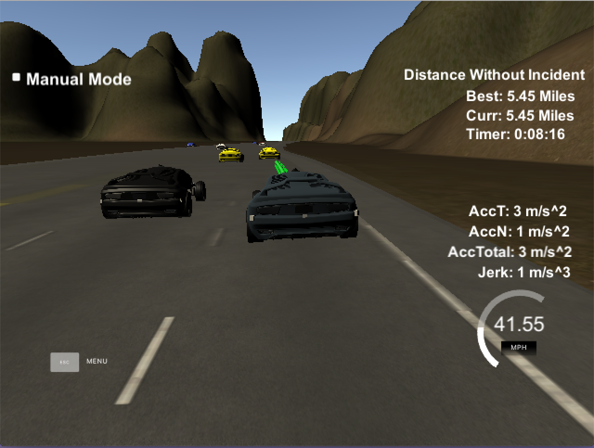

# Path Planning Project   

## Goals
The project goal is to safely navigate around a virtual highway with other traffic that is driving +-10 MPH of the 50 MPH speed limit. The car's localization and sensor fusion data is provided, there is also a sparse map list of waypoints around the highway. The car should try to go as close as possible to the 50 MPH speed limit, which means passing slower traffic when possible, note that other cars will try to change lanes too. The car should avoid hitting other cars at all cost as well as driving inside of the marked road lanes at all times, unless going from one lane to another. The car should be able to make one complete loop around the 6946m highway. Since the car is trying to go 50 MPH, it should take a little over 5 minutes to complete 1 loop. Also the car should not experience total acceleration over 10 m/s^2 and jerk that is greater than 10 m/s^3.

## Path Generation Model
The spline library `http://kluge.in-chemnitz.de/opensource/spline/` is used to generate a spline that shows the future path of the car. The high level concept of the path generation model is as follow: First pick 5 points, 3 from predicting the global x,y coordinates 30m, 60m, 90m in front of current location, and 2 from the previous path. Plug these 5 points to the spline library to form a spline. Then with regard to the reference speed we chose and how many points we need to refill to the next path vector, we generate these points using the spline.

We process those 5 points by first convert them from global coordinate to car's local coordinate, generate the spline, generate points we need to feed into next_x_vals/next_y_vals vectors and convert them back to global coordinate before sending them back.

Another thing worth mentioning is that we use a global variable `lane_number` to represent which lane our car should stay on. This information is used to generate the 3 future points to form the spline we mentioned in the first paragraph. We are able to do this because we know that the width of a lane is 4 meters, so the corresponding d coordinate for the car the stay in the middle of the lane in Frenet is `4*lane_number+2`. It makes implementing lane changing logic a lot easier, since this variable is the only thing we need to control to make the lane-changing happen.

## Control Speed
To determine a proper reference speed without exceeding the required speed, acceleration and jerk, we incrementally increase speed when no car is in front of us and decrease speed when there's a car in the front and its distance between our car is less than 30 meters and we are not able the change lane. We use 5 m/s^2 as the acceleration, which is under the 10 m/s^2 requirement. Also we use constant acceleration so in theory in the s direction of the Frenet coordination system, no jerk would be introduced. As for max speed we use 49.5 MPH which is below the 50 MPH requirement.

## Lane Changing Logic
The lane changing logic used in this project is very similar to the way people determine if they should change lane when driving on the highway. A sensor fusion data is given for every telemetry metrics received. This sensor data is consist of the states of all cars surrounding our car. The logic is as follow:

- left-most lane:
    - Check all the cars on the right lane and see if in the near future they are NOT going to be within +-20 meters w.r.t our current location in s of Frenet coordinate. If this criteria passed then change to right lane.

- right-most lane:
    - Check all the cars on the left lane and see if in the near future they are NOT going to be within +-20 meters w.r.t our current location in s of Frenet coordinate. If this criteria passed then change to left lane. 

- middle lane:
    - Check all the cars on the left lane first, then check the right lane. If left lane is clear then change to left lane, else to the right lane.

If the above criteria is not meet, then we decrease the car speed and stay on the lane.

## Result


---

## Build Instructions

1. Make a build directory: `mkdir build && cd build`
2. Compile: `cmake .. && make`
3. Run it: `./path_planning`

## Dependencies

* cmake >= 3.5
  * All OSes: [click here for installation instructions](https://cmake.org/install/)
* make >= 4.1
  * Linux: make is installed by default on most Linux distros
  * Mac: [install Xcode command line tools to get make](https://developer.apple.com/xcode/features/)
  * Windows: [Click here for installation instructions](http://gnuwin32.sourceforge.net/packages/make.htm)
* gcc/g++ >= 5.4
  * Linux: gcc / g++ is installed by default on most Linux distros
  * Mac: same deal as make - [install Xcode command line tools]((https://developer.apple.com/xcode/features/)
  * Windows: recommend using [MinGW](http://www.mingw.org/)
* [uWebSockets](https://github.com/uWebSockets/uWebSockets)
  * Run either `install-mac.sh` or `install-ubuntu.sh`.
  * If you install from source, checkout to commit `e94b6e1`, i.e.
    ```
    git clone https://github.com/uWebSockets/uWebSockets 
    cd uWebSockets
    git checkout e94b6e1
    ```

